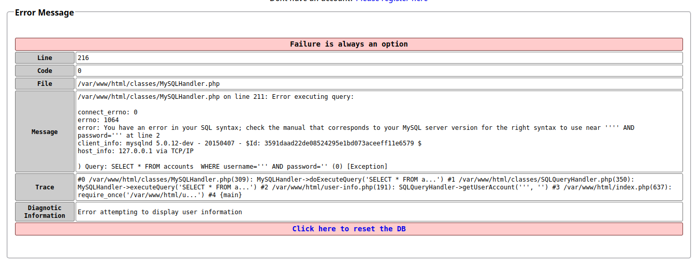

# Pentest Prático no OWASP Mutillidae II: Explorando as 10 Vulnerabilidades do OWASP Top 10.


Este guia apresenta uma abordagem prática para a exploração dos laboratórios do OWASP Mutillidae II, aplicação vulnerável mantida pela OWASP para fins educacionais.

Embora a plataforma contenha centenas de vulnerabilidades intencionalmente expostas, este material foca na exploração de 10 falhas alinhadas à OWASP Top 10 (2017), demonstrando técnicas, vetores de ataque e impactos práticos.

## A1 - Injection (SQL) ⮕ SQLi Extract Data ⮕ User Info (SQL).

Nessa primeira vulnerabilidade, nós temos uma missão muito simples: Extrair os dados do usuário.

Então nós nos deparamos com essa tela.


Nada muito animador. Nada muito revelador.

Se você já estudou um pouco sobre SQLi, você sabe pode inserir alguns comandos em URLS ou formulários. Dessa forma o servido te responde alguma coisa. Como eu aprendi a testar a URL, eu tentei uma aspas simples `'`. Essa tentativa, me retornou uma mensagem de erro. Então usei essa mesma aspas simples no formulário. Essa foi a resposta:



Essa é uma resposta de ERROR-BASED. Significa basicamente que podemos conseguir informações importantes do banco de dados, baseados em mensagens de erro.

O banco de dados esperava algo `admin`. O fato de eu ter colocado uma aspas simples quebrou a a estrutura lógica do banco de dados. Ele recebeu algo como `'''`. Com isso uma confusão foi criada e ele retornou uma mensagem de erro.

A vulnerabilidade em sí é esta mensagem de erro aparecer.

Confesso que fiquei um bom tempo pesquisando o que fazer depois. Vou aí que comecei a rabiscar no meu caderno e cheguei na seguinte conclusão:

Imagine que você tem um porteiro e ele só deixa entrar quem disser o NOME e a SENHA corretas.

Ele faz a seguinte pergunta para o banco de dados:
```
Esse nome é igual ao que está salvo?
E
Essa senha é igual à que está salva?
```

Se as duas respostas forem verdadeiras → você entra.

Em `SQL` a QUERRY seria desta forma:
```
SELECT * FROM accounts  WHERE username = 'admin' AND password = '1234';
```

Tradução: Me dê o usuário que tenha esse NOME e essa SENHA.

Se o banco de dados encontrar, você entra. ✅

Eu precisa burlar essa QUERY, então pensei no seguinte: `SE o banco não verifica minhas aspas simples, eu deixo ela lá. Mas o que colocar depois?`

Depois de mais algumas pesquisas eu cheguei no BOOLEAN-BASED, que basicamente você passa condições de verdadeiro ou falso para o banco e ele te dará uma resposta.

Então o raciocínio ficou parecido com isso: aspas simples COM mais alguma coisa condição booleana. Eu poderia inserir vários valores e reinventar a roda, mas escolhi o mais simples. '1' = '1'. Isso siginifica que 1 é igual a 1. Condição verdadeira sempre.

Minha Querry foi: `' '1'='1'`.

O banco me deu uma resposta dizendo que: Eu tentei fazer um login e tentei mas a senha ficou vazia. Ou seja, novamente ele menciona a senha nesta resposta.

Pesquisando um pouco mais, percebi que havia deixado de fora o operador lógico `OR`. E precisa também de alguma forma, ignorar o solicitação da senha. Isso se resolveria com `--` comentários. Isso nunca havia passado pela minha cabeça.

A queria correta fica assim: 
```
' OR '1'='1' --
```

Em Português:
```
O nome está vazio
OU
1 é igual a 1
```
Isso é o que vamos enviar para o login. E vamos ignorar por hora a senha.


